This repository hosts scripts and setup for learning-based power modeling of CPUs (`BOOM/`, `RI5CY/`, `common/`) and the issue-queue current-shaping work on top of it.

# Goal

Associate a **power token** and an **energy token** with every RISC-V instruction *category* from the hardware units that category actually uses (IQ, FU, RF ports, cache/MSHR). Use those tokens at **issue**, on top of BOOM’s default port-conflict grant, so the scheduler packs high-energy / long-demand uops together and low-energy uops together.

The PDN then sees **current plateaus** instead of HIGH–LOW–HIGH chatter. First-droop decoupling C exists to supply VRM-slew mismatch; fewer `di/dt` edges means less C, not less average energy.

`I(t)` is lumped BoomTile equivalent current at 1.1 V (LACPo composed sum, including glue). Clock is 3 ns.

# Machine (do not silently change)

LACPo pickles and the built Verilator sim are **Chipyard 1.3.0 `MediumBoomConfig`** only:

| | MediumBoom (this repo) |
|---|---|
| Decode / ROB / int RF | 2 / 64 / 80 |
| INT IQ | 20 entries, issue 2 |
| MEM IQ | 12 entries, issue 1 |
| FP IQ | 16 entries, issue 1 |
| LDQ / STQ | 16 / 16 |
| I$ / D$ | 16 KiB 4-way, 2 MSHR |

A 4-wide / ROB-128 / 2-AGU / 512 KiB L2 picture is **MegaBoom-class**. ICPP08 Table 2 is an 8-wide Alpha SMT (ACE tags, not BOOM). Do not retarget Chisel to either until LACPo is retrained.

# How instructions map onto hardware (and how current is modelled)

Two layers. We have (1) a **static** ISA → unit map from BOOM decode, and (2) **measured** per-block I(t) from LACPo on a real VCD. We do **not** yet have per-cycle occupancy `N_c[n]` (which classes sat in those units on hello). Tokens stay priors until that column exists.

```
RISC-V opcode  →  BOOM uopc + IQT_* + FU_*     (decode.scala)
               →  13 hardware classes          (units, ports, RF, latency)
               →  LOW / MID / HIGH token
                                          ↘
VCD activity nets → 20 LACPo DTs → P_u(t) → I_u = P_u / 1.1 V
                                          → tile I[n] = Σ I_u
I[n]  ≈  I0 + Σ_c w_c · N_c[n]     ← N_c still to extract from issue/EX
```

A per-dynamic-instruction joule is ill-posed: MediumBoom can issue 2 INT + 1 MEM + 1 FP in the same cycle, and a DIV keeps the FU for many cycles. The token grain is the **class**, and the scheduler spends the **sum** of in-flight classes.

## Static map: every opcode → units it utilizes

`tools/dump_decode_map.py` parses Chipyard 1.3 `decode.scala` (`riscv -> List(..., uop*, IQT_*, FU_*)`). That is BOOM’s own issue routing, not a guess.

| decode field | What it names | Where it goes |
|---|---|---|
| `uopc` | micro-op (`uopADD`, `uopLD`, `uopMUL`, …) | class via `SPECIAL_UOP` / `uopc_to_category` |
| `IQT_*` | which issue queue | INT (102 ops) / MEM (36) / FP (48) / MFP (2) |
| `FU_*` | which execution unit + port mask | `fu_code & fu_types(port)` at grant |

188 opcodes → 13 classes → 44 LOW / 81 MID / 63 HIGH. Full table: [`sim/isa_uop_map.csv`](sim/isa_uop_map.csv). Rollup (RF ports, EX latency, demand): [`sim/isa_hw_categories.csv`](sim/isa_hw_categories.csv). Code: [`tools/isa_hw_tokens.py`](tools/isa_hw_tokens.py).

`FU_*` → class (overrides for stores / AMO / FMA / branches / fence):

| `FU_*` | Class | Token | Medium ports that can take it | Hardware utilized |
|---|---|---|---|---|
| `FU_ALU` | INT_ALU (32) | LOW | INT0, INT1 | INT IQ, ALU, int RF (2R/1W), 1 clk |
| `FU_JMP` | INT_BR (9) | LOW | INT0 | INT IQ, ALU/BRU, BTB, gshare, RAS |
| `FU_MUL` | INT_MUL (5) | HIGH | **INT0 only** | INT IQ, IMul, int RF, ~3 clk |
| `FU_DIV` | INT_DIV (8) | HIGH | **INT1 only** | INT IQ, IDiv, int RF, long |
| `FU_CSR` | INT_CSR (36) | MID | INT1 | INT IQ, CSR pipe |
| `FU_MEM` + `uopLD` | MEM_LD (11) | MID | MEM0 | MEM IQ, AGU, LDQ, D$, MSHR, ~3 clk |
| `FU_MEM` + `uopSTA`/`uopSTD` | MEM_ST (6) | MID | MEM0 | MEM IQ, AGU, STQ, D$ |
| `FU_MEM` + `uopAMO_AG` | MEM_AMO (20) | HIGH | MEM0 | MEM IQ, AGU, LDQ, STQ, D$, long |
| `FU_FPU` (add/mul/…) | FP_ALU (18) | HIGH | FP0 | FP IQ, FPU, fp RF (2R/1W), 4 clk |
| `FU_FPU` + `uopFMADD*` | FP_FMA (8) | HIGH | FP0 | FP IQ, FPU, fp RF (3R/1W), 4 clk |
| `FU_FDV` | FP_DIV (4) | HIGH | FP0 | FP IQ, FDiv/Sqrt, long |
| `FU_I2F` / `FU_F2I` | FP_MOV (28) | MID | INT0 or FP0 | IntToFP / FPToInt, both RFs |
| `FU_X` / fence | SYS (3) | LOW | — | pipeline serialize |

Examples from the dump (same row format as the CSV):

| RISC-V | `uopc` | IQ | `FU_*` | Class | Units utilized |
|---|---|---|---|---|---|
| `ADDI` | `uopADDI` | INT | `FU_ALU` | INT_ALU | INT IQ + ALU + int RF |
| `BEQ` | `uopBEQ` | INT | `FU_ALU` | INT_BR | INT IQ + ALU/BRU + BTB/gshare |
| `MUL` | `uopMUL` | INT | `FU_MUL` | INT_MUL | INT IQ + IMul (INT0) + int RF |
| `DIV` | `uopDIV` | INT | `FU_DIV` | INT_DIV | INT IQ + IDiv (INT1) + int RF |
| `LD` | `uopLD` | MEM | `FU_MEM` | MEM_LD | MEM IQ + AGU + LDQ + D$ |
| `SD` | `uopSTA` | MEM | `FU_MEM` | MEM_ST | MEM IQ + AGU + STQ + D$ |
| `FMADD_D` | `uopFMADD_D` | FP | `FU_FPU` | FP_FMA | FP IQ + FPU (3R/1W) |

That is **utilization intent** — which blocks a uop is *allowed* to occupy. It is not a count of how many were in-flight on hello.

## Measured current: LACPo models the units, not the opcode

LACPo does **not** predict “this `addi` costs X mA.” Each of 20 pretrained DTs (PTPX hierarchical power, sklearn 0.20, depth 10) predicts **one hardware block’s** `P_u` from that block’s VCD activity features. Tile current is the composed sum:

```
P_tile[n] = Σ_u P_u[n]          (20 trees, including core_glue = parent − Σ children)
I_u[n]    = P_u[n] / 1.1 V
I_tile[n] = Σ_u I_u[n]
```

The instruction map tells us **which classes drive which trees**. Hello I(t) then says how hard those trees actually drew:

| Instruction classes | LACPo blocks they utilize | Hello mean → peak |
|---|---|---|
| INT_ALU, INT_BR, INT_MUL | INT IQ; INT0 ALU/JMP/MUL; int RF / RF read | IQ 2.1→14.4 mA; ALU0 4.5→20.2; RF 5.5→**37.2** |
| INT_CSR, INT_DIV | INT1 ALU/CSR/DIV; CSR file | 0.80→7.4 mA; 0.80→3.0 |
| MEM_LD, MEM_ST, MEM_AMO | MEM IQ; LSU (AGU/LDQ/STQ/D$) | IQ 2.0→12.5; LSU **flat 4.1** (unmatched nets) |
| FP_ALU, FP_FMA, FP_DIV, FP_MOV | FP IQ/FPU/FMA/FDiv | 8.1→19.4 (hello has no FP — floor) |
| INT_BR (+ all fetch) | I$/FTQ; BTB; gshare/BPD | fetch 4.8→9.4; BTB/BPD **flat** (unmatched) |
| every uop | decode0/1; maptables; freelists; ROB | decode 0.3 mA; ROB 2.5→8.0; rename peaks with INT EX |
| — | tile glue | 9.9→18.8 mA |

Frontend / decode / ROB / glue run for the pipeline, not for one opcode. The **issue-time packing knob** is the INT/MEM/FP IQ + EX + RF rows.

## Linear mix (how a token is supposed to be used)

```
I[n]  ≈  I0 + Σ_c  w_c · N_c[n]
E[n]  =  I[n] · 1.1 V · 3 ns
```

- `N_c[n]` — how many class-`c` uops **issued this cycle or still occupy EX** (DIV/FDIV/AMO keep charging).
- `w_c` — extra tile mA for one such occupant (the **power token**).
- `I0` — always-on floor (frontend + glue + unmatched flats). Hello puts this at **~64–73 mA**.
- `E[n]` — **energy token** for that cycle. A long-demand uop adds `w_c · V · Tclk` every cycle it holds the FU.

`prior_w_mA` in the CSVs (8 / 22 / 28 / …) are **relative priors**, not OLS. Hello gives a real `I[n]`. Occupancy `N_c[n]` from IQ `uopc` / `fu_code` / grant is the remaining fit input. Until that lands, do not treat a class’s prior as a measured utilization cost.

# Default grant, then current-class packing

Default BOOM (`IssueUnitCollapsing`, age-ordered): oldest ready slot whose `(fu_code & fu_types(port))` is nonzero takes the first free port. MediumBoom ports are not symmetric:

| Port | Can issue |
|---|---|
| INT0 | ALU, JMP, MUL, IntToFP |
| INT1 | ALU, CSR, DIV |
| MEM0 | load / store / AMO |
| FP0 | FPU, FMA, FDiv/Sqrt, FPToInt |

Packing keeps that legal-move generator and adds a current budget (Powering Superscalar Processors):

1. Grant HIGH next to HIGH (and long-demand next to long-demand: DIV / FDIV / AMO) so the PDN sees a high plateau.
2. Cap extra HIGH current per cycle (MediumBoom: typically one HIGH, not two stacked on the same edge).
3. Then grant LOW next to LOW for a low plateau.
4. MID (loads/stores) fill leftover ports; they are the AGU/D$ floor.

Do **not** mix a heavy with a light to “average” current. Averaging in the IQ is what creates the transients the capacitors absorb.

The ICPP08 VISA paper is the same *knob* (a decode tag that reorders grant) aimed at IQ AVF, not current. ACE ≠ HIGH.

How much of that legal window can actually move is measured next: [IQ reorder %](#how-much-of-the-issue-queue-can-reorder). Full tables: [`results/iq_reorder/`](results/iq_reorder/README.md).

# Layout

| Path | Role |
|---|---|
| `BOOM/` | LACPo pretrained DTs, PTPX, feature lists. See `BOOM/README.md`. |
| `RI5CY/` | In-order core power models. |
| `common/vcd2csv/` | VCD → cycle features. |
| `programs/` | HTIF: `hello`, `int_mix` (`tohost`). pk (no `tohost`): `idle`, `load_step`, `matmul`, `branch_storm`. |
| `sim/` | WSL Verilator wrappers, HTIF hello scripts, signal list, ISA maps. |
| `tools/` | LACPo invoke, Verilator→LACPo VCD remap, HW-current decomp, I(t) PNG export, IQ grant replay. |
| `results/hello_vcd/` | Hello-run I(t) figures + per-block summary. |
| `results/iq_reorder/` | How much of the IQ can legally reorder (%). |
| `results/int_mix/` | Future: HTIF ALU+MUL+DIV Verilator run (not executed). |
| `slides/iq-current-support.html` | Advisor B&W deck. |

Sim binary: `D:\chipyard\sims\verilator\simulator-chipyard-MediumBoomConfig-debug`. sklearn 0.20 only (`.envs/py37` / `environment.yml`).

# Findings: hello VCD → hardware current

First **real** MediumBoom cycle-level current: HTIF `hello` (fesvr `printf` + `tohost`, **no pk**, **no UART**), full Verilator dump, 20 LACPo trees, then `I_u = P_u / 1.1 V`. This is lumped **BoomTile equivalent supply current**, not a probed VDD net. Glue is `P_parent − Σ P_child` (tile leftover after the child DTs). Clock is 3 ns. sklearn 0.20.4, all 20 trees `source=features_csv`.

Gallery + CSV: [`results/hello_vcd/`](results/hello_vcd/README.md). Full-rate tables and the 213 MB VCD stay local (`traces/hello_vcd/`, `D:\cy-tmp\boom_real\`).

## Tile

| | P | I | Energy |
|---|---:|---:|---:|
| Min | 68.9 mW | 62.6 mA | |
| Mean | **80.0 mW** | **72.7 mA** | **4141 nJ** |
| Peak | **161.3 mW** | **146.6 mA** | |
| Cycles | 17 262 | Tclk 3 ns | 51.8 µs |

Hello is idle/reset for ~30 µs, then a short burst. Peak is **2.0×** mean. That burst — not the 72.7 mA floor — is what first-droop C has to cover.

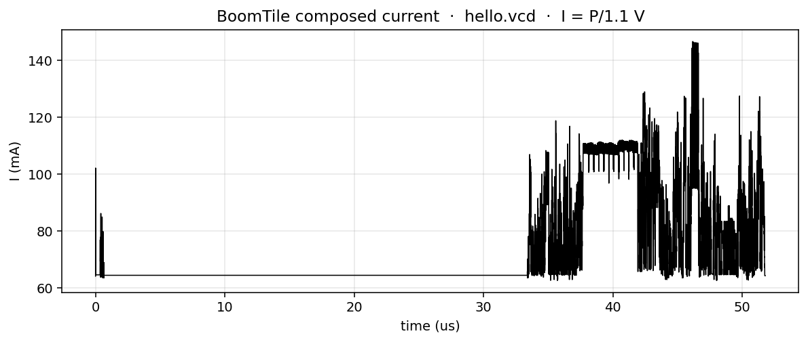

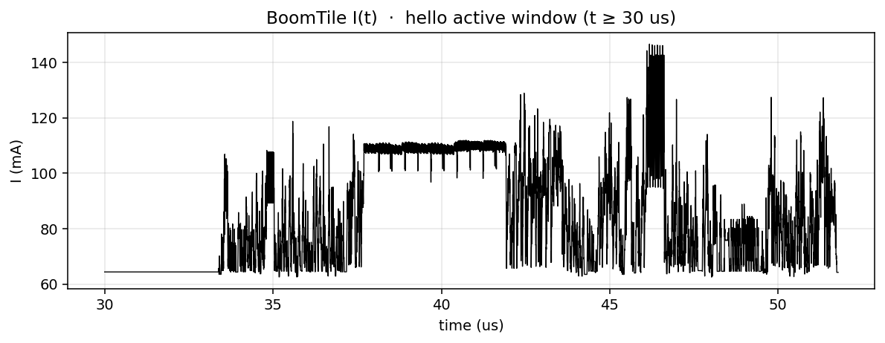

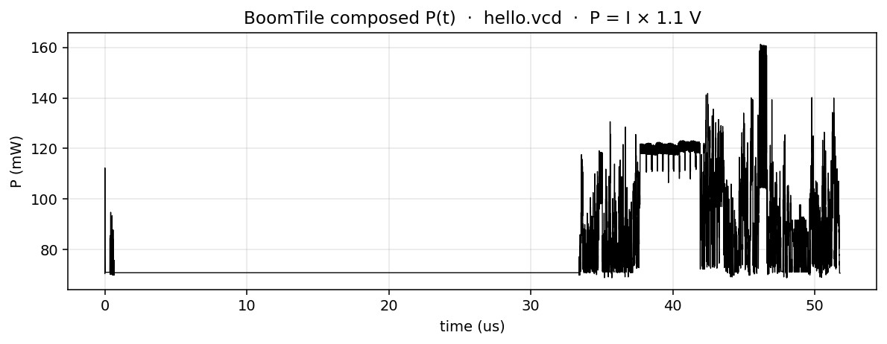

## Hardware groups

`I_group = Σ I_block` over the LACPo trees in that group.

| Group | Units | Mean (mA) | Peak (mA) | Share | Energy (nJ) |
|---|---|---:|---:|---:|---:|
| frontend | I$ / FTQ / BTB / gshare | 26.08 | 30.62 | **35.9%** | 1486 |
| INT EX | INT IQ, ALU0/1, int RF, CSR | 16.36 | **65.44** | 22.5% | 932 |
| glue | tile leftover | 9.89 | 18.76 | 13.6% | 563 |
| FP | FP IQ / FPU / FMA / FDiv | 8.07 | 19.37 | 11.1% | 460 |
| MEM | MEM IQ, LSU | 6.01 | 16.59 | 8.3% | 342 |
| rename / ROB | maptables, freelists, ROB | 5.98 | 26.66 | 8.2% | 341 |
| decode | decode0 + decode1 | 0.30 | 2.34 | 0.4% | 17 |

Frontend is the **floor** (almost flat, 26–31 mA). The **di/dt** is INT EX (peak 65 mA) plus rename/ROB (peak 27 mA) when hello actually runs. Decode is noise. FP is ~8 mA on a program with no FP — that is leakage / unmatched-feature floor, not FMA work.

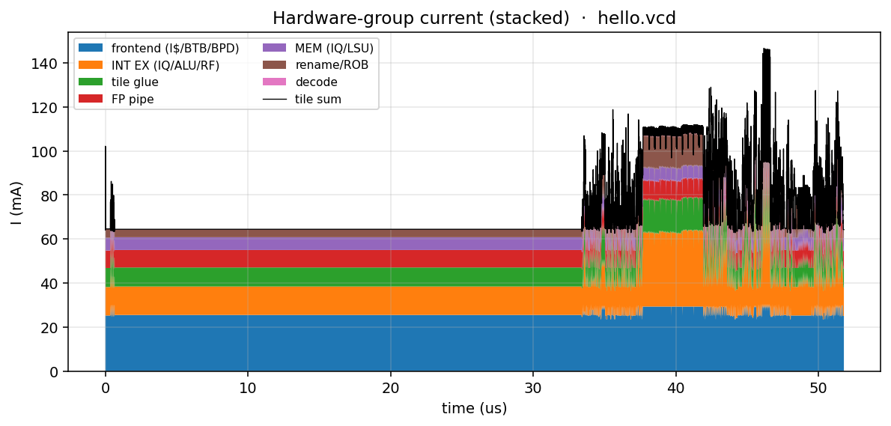

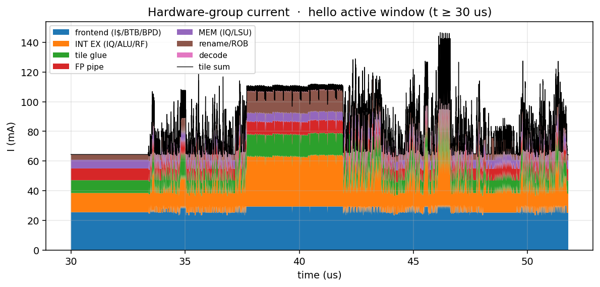

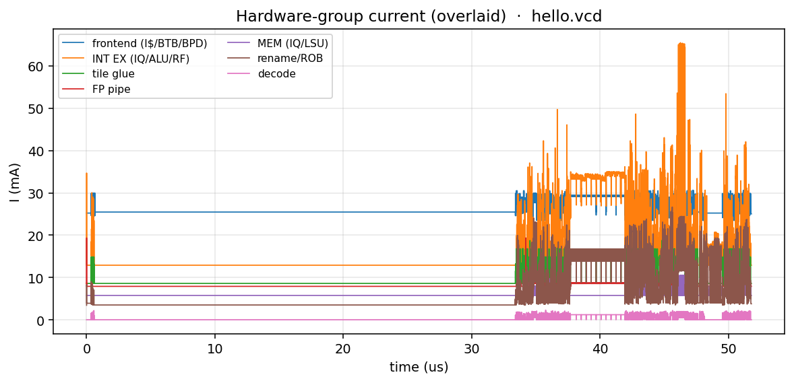

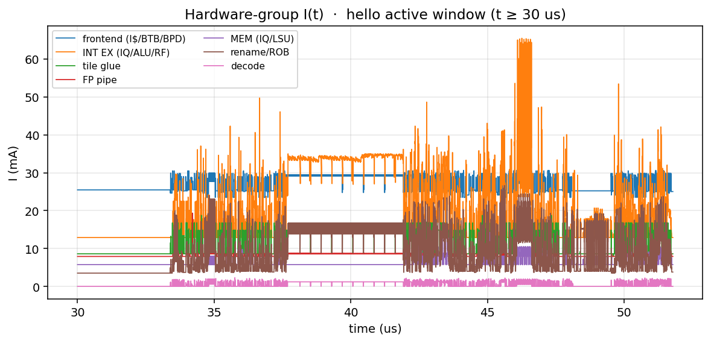

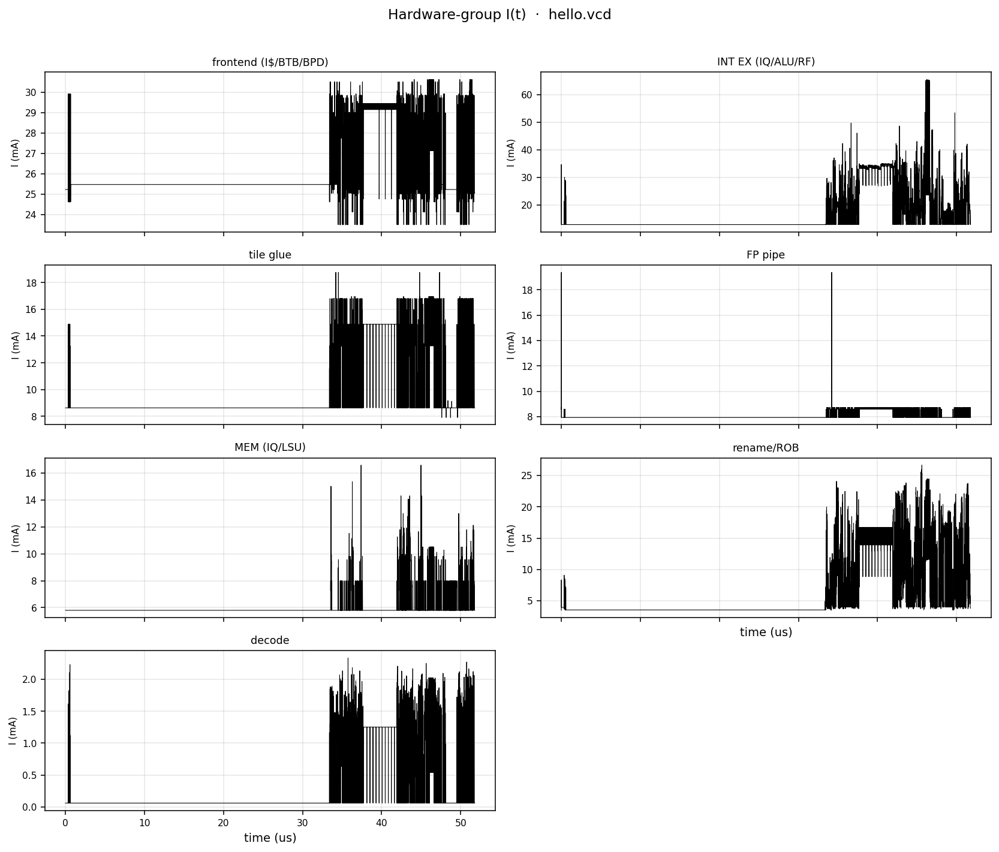

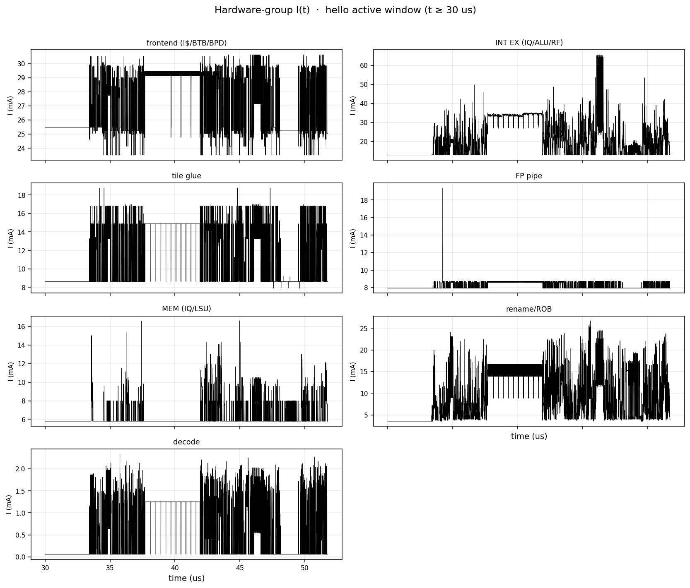

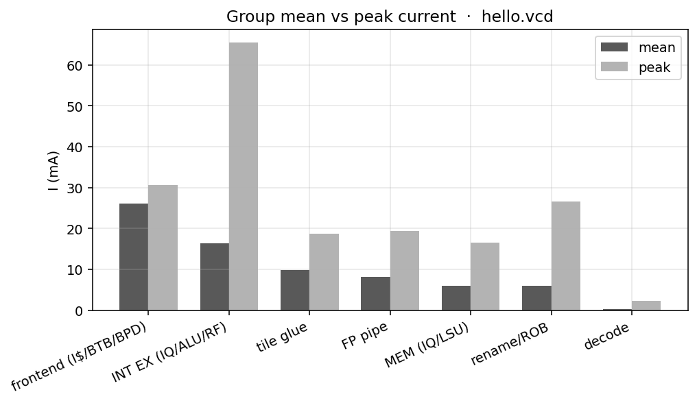

## Per-block (20 LACPo trees)

| Units | Group | Token prior | Mean (mA) | Peak (mA) | Share |
|---|---|---|---:|---:|---:|
| gshare / BPD | frontend | LOW | 15.82 | 15.82 | 21.8% |
| tile glue | glue | LOW | 9.89 | 18.76 | 13.6% |
| FP IQ / FPU / FMA / FDiv | fp | HIGH | 8.07 | 19.37 | 11.1% |
| int RF | int_ex | LOW | 5.51 | **37.24** | 7.6% |
| BTB | frontend | LOW | 5.45 | 5.45 | 7.5% |
| I$ / FTQ / fetch | frontend | LOW | 4.80 | 9.35 | 6.6% |
| INT0 ALU / JMP / MUL | int_ex | LOW | 4.47 | 20.17 | 6.1% |
| AGU / LDQ / STQ / D$ | mem | MID | 4.06 | 4.06 | 5.6% |
| int RF read | int_ex | LOW | 2.68 | 5.04 | 3.7% |
| ROB | rename_rob | LOW | 2.49 | 7.96 | 3.4% |
| INT IQ | int_ex | LOW | 2.10 | 14.45 | 2.9% |
| MEM IQ | mem | MID | 1.96 | 12.54 | 2.7% |
| int maptable | rename_rob | LOW | 1.21 | 7.73 | 1.7% |
| fp maptable | rename_rob | MID | 1.15 | 7.17 | 1.6% |
| CSR file | int_ex | MID | 0.80 | 3.02 | 1.1% |
| INT1 ALU / CSR / DIV | int_ex | MID | 0.80 | 7.39 | 1.1% |
| int freelist | rename_rob | LOW | 0.78 | 3.70 | 1.1% |
| fp freelist | rename_rob | MID | 0.35 | 2.36 | 0.5% |
| decode1 | decode | LOW | 0.17 | 1.28 | 0.2% |
| decode0 | decode | LOW | 0.14 | 1.36 | 0.2% |

CSV: [`results/hello_vcd/hw_current_summary.csv`](results/hello_vcd/hw_current_summary.csv).

Peak movers on this run: **int RF (37 mA)**, INT0 ALU (20 mA), INT IQ (14 mA), MEM IQ (13 mA). Those are the hardware tags the issue queue can actually see. Mean current is dominated by **gshare (constant 15.8 mA)** + glue + a dead FP pipe — that is *not* a packing knob.

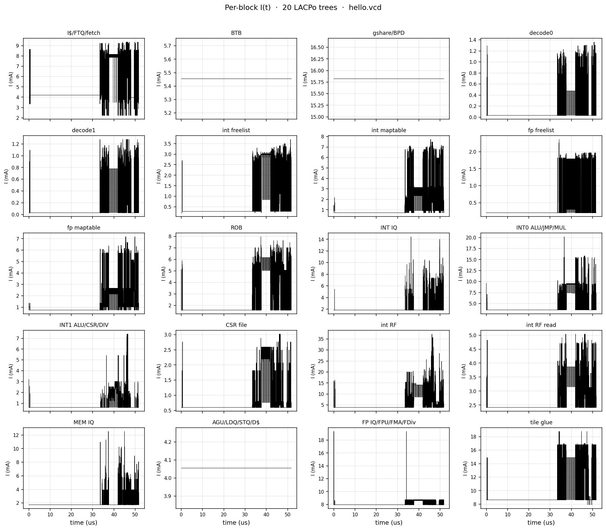

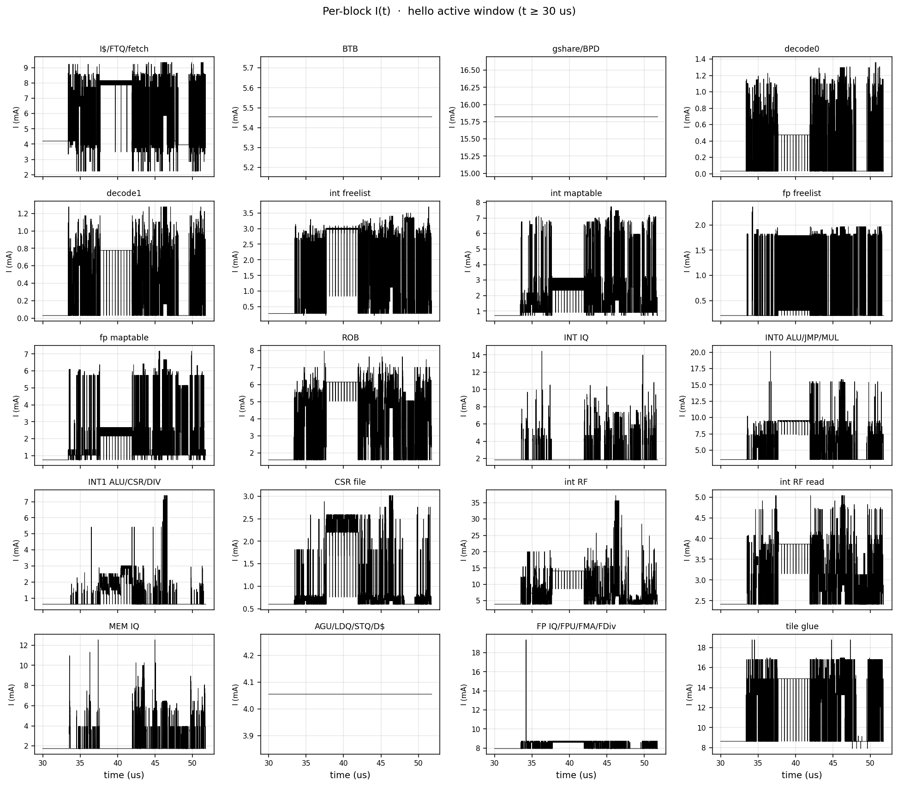

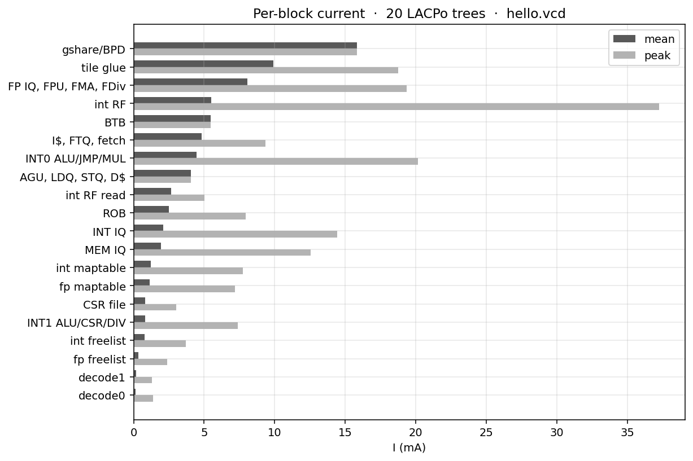

## What this means for tokens / C

- A per-dynamic-instruction joule is still ill-posed (2-wide INT + MEM + FP). Tokens stay **hardware-class × occupancy**: `I[n] ≈ I0 + Σ w_c N_c[n]`.
- **I0 ≈ 64–73 mA** on hello (frontend + glue + flat BPD/LSU/FP). The scheduler only spends the **delta**.
- The units that slew are INT RF / INT0 / INT IQ / rename — i.e. the LOW integer class firing together, not the HIGH FP/DIV priors. Hello does not excite MUL/DIV/FMA/AMO, so those `w_c` are still **unmeasured**.
- Packing HIGH-with-HIGH will not show up on this trace. The useful observation is already here: INT EX peak is **4×** its mean (16 → 65 mA). That is the `di/dt` first-droop C pays for. Plateau packing of integer issue is the first lever.
- 3 tags (LOW/MID/HIGH) are enough to *name* the budget. They are **not** yet enough to claim a C reduction — need `N_c[n]` from the IQ and a workload that actually issues HIGH.

## How the current was obtained

1. **HTIF, not UART.** `printf` goes to fesvr via `tohost`/`fromhost`. TestHarness UART stays null. `*** PASSED ***` prints only with `+verbose` (and that enables huge BOOM commit printf). Look for fesvr stdout + `sim_exit=0`.
2. **No pk on hello.** `pk` + `load_step` boots bbl (~millions of cycles) and was run without `+vcdfile` on purpose. Hello is linked with `htif_nano.specs` (`sim/run_htif_hello.sh`). A 200k-cycle cap is only a watchdog; hello already exits via `tohost` in ~8 s of sim.
3. **Full VCD** (`sim/run_htif_hello_full.sh`): 213 MB, 17 262 cycles, `+vcdfile` on the debug MediumBoom sim.
4. **Name remap** (`tools/vcd2features.py`): Verilator flattens `TOP.TestHarness.dut.system.boom_tile...`. LACPo was trained on `TestDriver.testHarness.TestHarness.boom_tile.core...`. Remap: prefix swap, `core.lsu` → `lsu`, `ALUExeUnit` → `jmp_unit`, `brinfo` → `brupdate`, unique leaf fallback. Clock → `...boom_tile.lsu.clock`. **204 / 326** nets matched; unmatched traces are **zero-filled**.
5. **Compose** (`tools/run_lacpo_flow.py --vcd`): 20 DTs → `composed_P_t.csv` + `load_current.pwl`.
6. **Decompose** (`tools/decompose_hw_current.py`): `I_u = P_u / 1.1`, 7 groups. **Export** (`tools/export_hw_current_plots.py`): PNGs `01`–`13`.

Unmatched on this dump (look constant — **do not treat as measured power**):

- gshare / BPD = 15.82 mA flat
- BTB = 5.45 mA flat
- LSU (AGU/LDQ/STQ/D$) = 4.06 mA flat

Those are missing BPD/LSU leaf nets in the flattened VCD, not a physical DC load.

## Reproduce

```text
wsl -d Ubuntu -e bash sim/run_htif_hello.sh
wsl -d Ubuntu -e bash sim/run_htif_hello_full.sh
python tools/run_lacpo_flow.py --vcd D:\cy-tmp\boom_real\hello.vcd
python tools/decompose_hw_current.py D:\cy-tmp\boom_real\lacpo_hello\composed_P_t.csv D:\cy-tmp\boom_real\lacpo_hello
python tools/export_hw_current_plots.py D:\cy-tmp\boom_real\lacpo_hello traces\hello_vcd
```

# How much of the issue queue can reorder

Hello showed the **knob** is INT EX (IQ / ALU0 / int RF), not frontend floor. Next question: of BOOM’s legal grant, how often can we pick a *different* ready uop so the PDN sees a plateau instead of HIGH–LOW chatter?

Full write-up, window tables, and runtime %: **[`results/iq_reorder/`](results/iq_reorder/README.md)**. Code: [`tools/sim_iq_reorder.py`](tools/sim_iq_reorder.py).

MEM IQ and FP IQ are 1-wide → **0%**. INT IQ is 2-wide (20 entries, issue 2). Only the *ready* head can move, a few slots deep — not the tail of the 20.

**Share of ready INT windows where pack ≠ age-order**

| Ready uops | hello-like | ALU+MUL+DIV | HIGH-heavy | full mix |
|---|---:|---:|---:|---:|
| 3 | 23% | 43% | 37% | 46% |
| 6 | 40% | **71%** | 72% | **77%** |
| 10 | 51% | **76%** | 83% | **82%** |

**Runtime cycles that actually issue a different set** (same arrivals, 12k cycles): hello-like **14%**, INT chatter **20%**, mixed INT ports **83%**, all-HIGH **12%**.

Mixed INT ready windows: **about 70–80% can reorder**. All-ALU or all-HIGH: much less. Pack reaches the 3rd–4th oldest ready slot (~44% of packed grants are not the two oldest on the chatter mix).

Policy (still legal ports, still fill them): pick the grant closest to last-cycle I, then to a slow VRM EMA. Token I(t) from that replay is **experimental** (priors, not LACPo) — do not quote it as mA or C saved. It lives in the same folder so the experiment is logged.

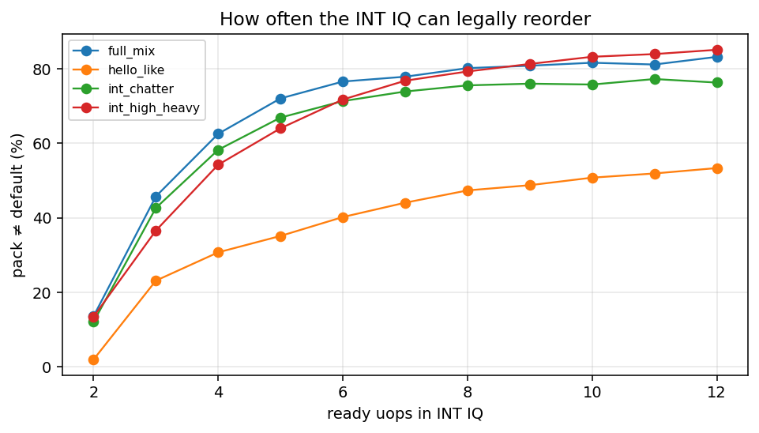

```text
python tools/sim_iq_reorder.py
```

# Landed

1. Hello VCD → hardware current — [`results/hello_vcd/`](results/hello_vcd/README.md)
2. ISA → unit map — [`sim/isa_uop_map.csv`](sim/isa_uop_map.csv)
3. How much of the INT IQ can legally reorder — [`results/iq_reorder/`](results/iq_reorder/README.md)

Do not start IQ RTL, do not retarget `config-mixins.scala`, and do not treat prior `w_c` or the experimental token I(t) as measured.

# Future direction

A later **Verilator MediumBoom** run of `int_mix` (not now): HTIF ALU+MUL+DIV so the INT IQ actually has HIGH and LOW ready together. Kernel and scripts are already in the tree — `programs/int_mix.c`, `sim/run_htif_int_mix.sh`, `sim/run_htif_int_mix_full.sh` — notes at [`results/int_mix/`](results/int_mix/README.md). After that VCD: occupancy `N_c[n]`, OLS tokens, grant replay on a real stream, then Chisel. Still MediumBoom only.
